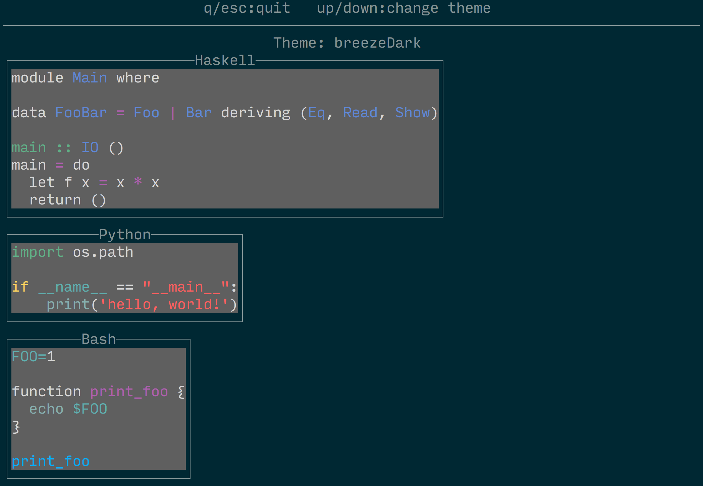

brick-skylighting
=================

This package extends the [brick](https://github.com/jtdaugherty/brick)
library with syntax highlighting support using the
[Skylighting](https://github.com/jgm/skylighting) library.

See the Haddock documentation for `Brick.Widgets.Skylighting` for API
details, and see the demonstration program in `programs` for a complete
working example.

Note: this library requires its users to provide syntax highlighting
definitions. For that, there are two choices:

 * Obtain XML specifications from e.g. the `skylighting-core` sources,
   then bundle these with your program files. Those files are
   GPL-licensed, so this option is preferable when you want to ship
   these GPL-licensed files with your program without the GPL infecting
   the license of your application.

 * Use the compiled-in syntax specifications in the `skylighting`
   package. This option is preferable if you are okay with a
   GPL-licensed dependency (i.e. if your application is also GPL'd) and
   you especially want to avoid having to bundle the XML files with your
   application or avoid the runtime loading of such files.
